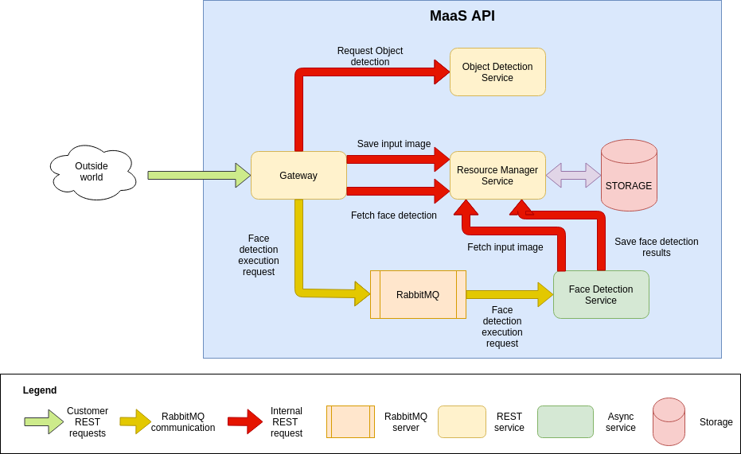

# Model as a Service - DL model deployment workshop

## Prerequisites
* Operating system: Linux - preferable Ubuntu. Windows support - experimental
* Docker (recommended version: ``19.03``)
* docker-compose (recommended version: ``1.28.5``)
* Postman app

## Environment setup
One should execute two commands before workshop to make sure everything works (in context of ``master`` branch).

First one to build services:
```bash
respository_root$ docker-compose build
```

Second one to build playground: [here](./playground/README.md)

In case of any issues please contact me via official conference channel.

## Running services
```bash
respository_root$ docker-compose up
```

## Postman docs
One may make use of [Postman docs](./postman_docs/ModelAsAServiceV2.postman_collection.json).

## Workshop instruction
One may find instruction [here](https://docs.google.com/presentation/d/1evTpBg3eFMDigZlPdehKCJJ-cE78ehIHLciK3u7-IY4/edit?usp=sharing)

## Services overview



